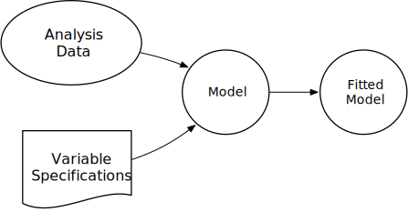
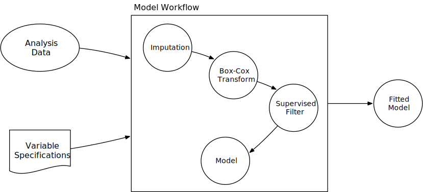

```{r knitr, include = FALSE}
library(knitr)
opts_chunk$set(digits = 3, fig.path = "images/part-1-")

hexes <- function(x) {
  x <- rev(sort(x))
  markup <- function(pkg) glue::glue('')
  res <- purrr::map_chr(x, markup)
  paste0(res, collapse = "")
}
```

class: title-slide, center

<span class="fa-stack fa-4x">
  <i class="fa fa-circle fa-stack-2x" style="color: #ffffff;"></i>
  <strong class="fa-stack-1x" style="color:#E7553C;">`r rmarkdown::metadata$session`</strong>
</span> 

# `r rmarkdown::metadata$title`

## `r rmarkdown::metadata$subtitle`


---
class: middle, center

.pull-left[
# <i class="fas fa-wifi"></i>

Wifi network name  

`r params$wifi_network`

]

.pull-left[
# <i class="fas fa-key"></i>

Wifi password

`r params$wifi_password`

]

---
class: middle, center

# <i class="fas fa-cloud"></i>

# Go here and log in (free):

[`r params$cloud_link`](`r params$cloud_link`)


---
layout: true

<div class="my-footer"><span>`r params$site_link`</span></div>


---
# Why R for Modeling?

.pull-left[
* _R has cutting edge models_. 
  
  Machine learning developers in some domains use R as their primary computing environment and their work often results in R packages.


* _It is easy to port or link to other applications_. 

  R doesn't try to be everything to everyone. If you prefer models implemented in C, C++, `tensorflow`, `keras`, `python`, `stan`, or `Weka`, you can access these applications without leaving R. 
]

.pull-right[
* _R and R packages are built by people who **do** data analysis_. 

* _The S language is very mature_. 

* The machine learning environment in R is extremely rich. 
]

---

# Downsides to Modeling in R


.pull-left[
* R is a data analysis language and is not C or Java. If a high performance deployment is required, R can be treated like a prototyping language.  

* R is mostly memory-bound. There are plenty of exceptions to this though. 
]

.pull-right[
The main issue is one of _consistency of interface_. For example: 
* There are two methods for specifying what terms are in a model<sup>1</sup>. Not all models have both. 
* 99% of model functions automatically generate dummy variables. 
* Sparse matrices can be used (unless they can't).
]

.footnote[[1] There are now three but the last one is brand new and will be discussed later.]


---

# Syntax for Computing Predicted Class Probabilities

|Function     |Package      |Code                                                 |
|:------------|:------------|:----------------------------------------------------|
|`lda`        |`MASS`       |`predict(obj)`                                       |
|`glm`        |`stats`      |`predict(obj, type = "response")`                    |
|`gbm`        |`gbm`        |`predict(obj, type = "response", n.trees)`           |
|`mda`        |`mda`        |`predict(obj, type = "posterior")`                   |
|`rpart`      |`rpart`      |`predict(obj, type = "prob")`                        |
|`Weka`       |`RWeka`      |`predict(obj, type = "probability")`                 |
|`logitboost` |`LogitBoost` |`predict(obj, type = "raw", nIter)`                  |
|`pamr.train` |`pamr`       |`pamr.predict(obj, type = "posterior", threshold)`   |

We'll see a solution for this later in the class. 


---

# `tidymodels` Collection of Packages  `r I(hexes(c("tidymodels")))`

.code90[

```{r tm}
library(tidymodels)
```

]

```{r others, include = FALSE}
library(kableExtra)
library(ggthemes)
library(countdown)
```

Plus [`tidypredict`](http://tidypredict.netlify.com/), [`tidyposterior`](https://tidymodels.github.io/tidyposterior/), [`tidytext`](https://github.com/juliasilge/tidytext), and more in development.

```{r ggplot, include = FALSE}
thm <- theme_bw() + 
  theme(
    panel.background = element_rect(fill = "transparent", colour = NA), 
    plot.background = element_rect(fill = "transparent", colour = NA),
    legend.position = "top",
    legend.background = element_rect(fill = "transparent", colour = NA),
    legend.key = element_rect(fill = "transparent", colour = NA)
  )
theme_set(thm)
```

---

# Example Data Set - House Prices

For our examples, we will use the Ames IA housing data. There are 2,930 properties in the data. 

The Sale Price was recorded along with 81 predictors, including:

* Location (e.g. neighborhood) and lot information.
* House components (garage, fireplace, pool, porch, etc.).
* General assessments such as overall quality and condition.
* Number of bedrooms, baths, and so on. 

More details can be found in [De Cock (2011, Journal of Statistics Education)](http://ww2.amstat.org/publications/jse/v19n3/decock.pdf).

The raw data are at [`http://bit.ly/2whgsQM`](http://bit.ly/2whgsQM) but we will use a processed version found in the [`AmesHousing`](https://github.com/topepo/AmesHousing) package. 


---

# Example Data Set - House Prices

```{r ames-map, echo = FALSE, message = FALSE, fig.align='center', dev = "svg"}
library(AmesHousing)
library(leaflet)
library(htmltools)
library(Cairo)
ames <- make_ames()

col_key <- c(
  'NAmes',     '#0000FF',
  'CollgCr',   '#FF0000',
  'OldTown',   '#FFFFFF',
  'Edwards',   '#FF00B6',
  'Somerst',   '#FF3030',
  'NridgHt',   '#009FFF',
  'Gilbert',   '#DD00FF',
  'Sawyer',    '#9A4D42',
  'NWAmes',    '#00FFBE',
  'SawyerW',   '#1F9698',
  'Mitchel',   '#FFACFD',
  'BrkSide',   '#720055',
  'Crawfor',   '#F1085C',
  'IDOTRR',    '#FE8F42',
  'Timber',    '#004CFF',
  'NoRidge',   '#ffff00',
  'StoneBr',   '#B1CC71',
  'SWISU',     '#02AD24',
  'ClearCr',   '#FFD300',
  'MeadowV',   '#886C00',
  'BrDale',    '#FFB79F',
  'Blmngtn',   '#858567',
  'Veenker',   '#A10300',
  'NPkVill',   '#00479E',
  'Blueste',   '#DC5E93',
  'Greens',    '#93D4FF',
  'GreenHills', '#e5f2e5', 
  'Landmrk',   '#C8FF00'
) 
col_key <- as.data.frame(matrix(col_key, byrow = TRUE, ncol = 2))
names(col_key) <- c("Neighborhood", "color")
col_key <- col_key %>%
    mutate(
      Neighborhood =
        dplyr::recode(
          Neighborhood,
          "Blmngtn" = "Bloomington_Heights",
          "Bluestem" = "Bluestem",
          "BrDale" = "Briardale",
          "BrkSide" = "Brookside",
          "ClearCr" = "Clear_Creek",
          "CollgCr" = "College_Creek",
          "Crawfor" = "Crawford",
          "Edwards" = "Edwards",
          "Gilbert" = "Gilbert",
          "Greens" = "Greens",
          "GreenHills" = "Green_Hills",
          "IDOTRR" = "Iowa_DOT_and_Rail_Road",
          "Landmrk" = "Landmark",
          "MeadowV" = "Meadow_Village",
          "Mitchel" = "Mitchell",
          "NAmes" = "North_Ames",
          "NoRidge" = "Northridge",
          "NPkVill" = "Northpark_Villa",
          "NridgHt" = "Northridge_Heights",
          "NWAmes" = "Northwest_Ames",
          "OldTown" = "Old_Town",
          "SWISU" = "South_and_West_of_Iowa_State_University",
          "Sawyer" = "Sawyer",
          "SawyerW" = "Sawyer_West",
          "Somerst" = "Somerset",
          "StoneBr" = "Stone_Brook",
          "Timber" = "Timberland",
          "Veenker" = "Veenker"
        ))

lon_rnd <- range(ames$Longitude)
lat_rnd <- range(ames$Latitude)

ia_map <- leaflet(width = "100%") %>%
  addProviderTiles(providers$Stamen.Toner)

for(i in 1:nrow(col_key)) {
  ia_map <- ia_map %>%
    addCircles(
      data = subset(ames, Neighborhood == col_key$Neighborhood[i]),
      lng = ~Longitude, lat = ~Latitude,
      color = col_key$color[i],
      fill = TRUE,
      fillColor = col_key$color[i],
      radius = 6,
      popup = htmlEscape(col_key$Neighborhood[i]),
      opacity = .25)
}
ia_map
```


---

# Tidyverse Syntax `r I(hexes(c("dplyr")))`

Many tidyverse functions have syntax unlike base R code. For example:

* Vectors of variable names are eschewed in favor of _functional programming_. For example: 

```{r func-ex, eval = FALSE}
contains("Sepal")

# instead of 

c("Sepal.Width", "Sepal.Length")
```

* The _pipe_ operator is preferred. For example:

```{r pipe-ex, eval = FALSE}
merged <- inner_join(a, b)

# is equal to

merged <- a %>%
  inner_join(b) 
```

* Functions are more _modular_ than their traditional analogs (`dplyr`'s `filter()` and `select()` vs `base::subset()`)

---

# Some Example Data Manipulation Code `r I(hexes(c("readr", "dplyr")))`

.font10[

```{r tidy-example, message = FALSE, warning = FALSE}
library(tidyverse)

ames_prices <- "http://bit.ly/2whgsQM" %>%
  read_delim(delim = "\t", guess_max = 2000) %>%
  rename_at(vars(contains(' ')), list(~gsub(' ', '_', .))) %>%
  dplyr::rename(Sale_Price = SalePrice) %>%
  dplyr::filter(!is.na(Electrical)) %>%
  dplyr::select(-Order, -PID, -Garage_Yr_Blt)

ames_prices %>%
  group_by(Alley) %>%
  summarize(
    mean_price = mean(Sale_Price / 1000),
    n = sum(!is.na(Sale_Price))
  )
```

]

---

# Examples of `purrr::map*` `r I(hexes(c("purrr", "dplyr")))`

purrr contains functions that _iterate over lists_ without the explicit use of loops. They are similar to the family of apply functions in base R, but are type stable.


.pull-left[

```{r purrr-example-lhs}
# purrr loaded with tidyverse or tidymodels package

mini_ames <- ames_prices %>%
  dplyr::select(Alley, Sale_Price, Yr_Sold) %>%
  dplyr::filter(!is.na(Alley))

head(mini_ames, n = 5)
```

]

.pull-right[
```{r purrr-split-map}
by_alley <- split(mini_ames, mini_ames$Alley)
# map(.x, .f, ...)
map(by_alley, head, n = 2)
```

]

---

# Examples of `purrr::map*` `r I(hexes(c("purrr", "dplyr")))`

.pull-left[
```{r purrr-map-nrow}
map(by_alley, nrow)
```

`map()` always returns a list. Use suffixed versions for simplification of the result.

```{r purrr-map-int}
map_int(by_alley, nrow)
```

]

.pull-right[

Complex operations can be specified using a _formula notation_. Access the current
thing you are iterating over with `.x`.

```{r purrr-map-summarise}
map(
  by_alley, 
  ~summarise(.x, max_price = max(Sale_Price))
)
```

]

---

# `purrr` and list-columns `r I(hexes(c("purrr", "dplyr", "tidyr")))`

Rather than using `split()`, we can `tidyr::nest()` by `Alley` to get a data frame with
a _list-column_. We often use these when working with _multiple models_.

.pull-left[

```{r tidyr-nest}
ames_lst_col <- nest(mini_ames, -Alley)
ames_lst_col
```

]

.pull-right[

```{r list-col-mutate}
ames_lst_col %>%
  mutate(
    n_row = map_int(data, nrow),
    max   = map_dbl(data, ~ max(.x$Sale_Price))
  )
```

]

---

# Quick Data Investigation

To get warmed up, let's load the real Ames data and do some basic investigations into the variables, such as exploratory visualizations or summary statistics. The idea is to get a feel for the data. 

Let's take 10 minutes to work on your own or with someone next to you. Collaboration is highly encouraged!

To get the data:

```{r load-ames}
library(AmesHousing)
ames <- make_ames()
```


`r countdown(minutes = 10, left = 1)`


---

# The Modeling _Process_

Common steps during model building are:

* estimating model parameters (i.e. training models)

* determining the values of _tuning parameters_ that cannot be directly calculated from the data

* model selection (within a model type) and model comparison (between types)

* calculating the performance of the final model that will generalize to new data

Many books and courses portray predictive modeling as a short sprint. A better analogy would be a marathon or campaign (depending on how hard the problem is). 


---

# What the Modeling Process Usually Looks Like

```{r mod-process, echo = FALSE, out.width = '95%', fig.width=8, fig.height=2.5, fig.align='center', dev = 'svg', dev.args = list(bg = "transparent"), warning=FALSE}
widths <- c(8, 4, 10, 2, 6, 6, 
            rep(1, 19), 2,
            rep(1, 19), 2,
            rep(1, 19), 2,
            rep(1, 19), 2,
            4, 8, 15,
            rep(1, 29), 6,
            rep(1, 29), 4,
            1)
srt <- c(1, cumsum(widths))
stp <- srt[-1]
srt <- srt[-length(srt)]

diag_cols <- c(EDA = "#377EB8", "Quantitative Analysis" = "#A6CEE3", 
               "Feature Engineering" = "#4DAF4A", "Model Fit" = "#E41A1C", 
               "Model Tuning" = "grey")

bar_loc <- data.frame(srt = srt,
                  stp = stp,
                  g = c("EDA", "Quantitative Analysis", "EDA", "Quantitative Analysis", "EDA", "Feature Engineering", 
                        rep(c("Model Fit", "Model Tuning"), 40),
                        "Quantitative Analysis", "EDA", "Feature Engineering",
                        rep(c("Model Fit", "Model Tuning"), 14), "Model Fit", "Feature Engineering",
                        rep(c("Model Fit", "Model Tuning"), 14), "Model Fit", "Quantitative Analysis",
                        "Model Fit"))
bar_loc$ytop <- 1.9
bar_loc$ybot <- 1
bar_loc$g <- factor(as.character(bar_loc$g), 
                levels = c("EDA", "Quantitative Analysis", "Feature Engineering",
                           "Model Fit", "Model Tuning"))
text_loc <- data.frame(x = c(1, 8, 30, 36, 120, 124, 132, 147, 211, 215)+1,
                       y = 2.1)
text_loc$label <- letters[1:nrow(text_loc)]

mod_loc <- data.frame(x = c(45, 66, 87, 107, 162, 195)+1,
                      y = .75, 
                      label = c("Model\n#1", "Model\n#2", "Model\n#3", "Model\n#4",
                                "Model\n#2", "Model\n#4"))

ggplot(bar_loc) + 
  geom_rect(aes(fill = g, xmin = srt, xmax = stp,
                ymin = ybot, ymax = ytop), alpha = .7)  + 
  theme(
    legend.position = "bottom",
    legend.background = element_blank(),
    axis.line = element_blank(),
    axis.text.x = element_blank(),
    axis.text.y = element_blank(),
    axis.ticks = element_blank(),
    axis.title.x = element_text(hjust = .05),
    axis.title.y = element_blank(),
    panel.background = element_blank(),
    panel.border = element_blank(),
    panel.grid.major = element_blank(),
    panel.grid.minor = element_blank(),
    plot.background = element_blank()
    ) +
  scale_fill_manual(values = diag_cols, name = "") +
  geom_text(data = text_loc, aes(x = x, y = y, label = label)) + 
  geom_text(data = mod_loc, aes(x = x, y = y, label = label), size = 3) +   
  xlab("Time") + 
  ylim(c(.5, 2.25))
```


---

# What Are We Doing with the Data?


.pull-left[
We often think of the model as the _only_ real data analysis step in this process.

However, there are other procedures that are often applied before or after the model fit that are data-driven and have an impact. 

If we only think of the model as being important, we might end up accidentally overfitting to the data in-hand. This is very similar to the problems of "the garden of forking paths" and "p-hacking" [(pdf)](http://www.stat.columbia.edu/~gelman/research/unpublished/p_hacking.pdf). 
]
.pull-right[

```{r simple-proc, echo = FALSE, out.width = '75%', fig.align='center', dev = 'svg', dev.args = list(bg = "transparent"), warning=FALSE}

```

]


---

# Define the Data Analysis Process

.pull-left[
Let's conceptualize a process or _workflow_ that involves all of the steps where the data are analyzed in a significant way. The includes the model but might also include other _estimation_ steps:

 * data preparation steps (e.g. imputation, encoding, transformations, etc)
 
 * selection of which terms go into the model

and so on. 

Admittedly, there is some grey area here. 

]
.pull-right[


```{r realistic-proc, echo = FALSE, out.width = '95%', fig.align='center', dev = 'svg', dev.args = list(bg = "transparent"), warning=FALSE}

```

This concept will become important when we talk about measuring performance of the modeling process. 

]
 
---

# Some naming conventions

There are a few suffixes that we'll use for certain types of objects:

 * `_mod` for a `parsnip` model specification
 
 * `_fit` for a fitted model
 
 * `_rec` for a recipe
 
 * `_wfl` for a workflow
 
 * `_tune` for a tuning object
 
 * `_res` for a general result
 
 

---

# Resources

* [`http://www.tidyverse.org/`](http://www.tidyverse.org/)
* [R for Data Science](http://r4ds.had.co.nz/)
* Jenny's  [`purrr` tutorial](https://jennybc.github.io/purrr-tutorial/) or [Happy R Users Purrr](https://www.rstudio.com/resources/videos/happy-r-users-purrr-tutorial/)
* Programming with `dplyr` [vignette](https://cran.r-project.org/web/packages/dplyr/vignettes/programming.html)
* Selva Prabhakaran's [`ggplot2` tutorial](http://r-statistics.co/Complete-Ggplot2-Tutorial-Part1-With-R-Code.html)
* `caret` package [documentation](https://topepo.github.io/caret/)
* [CRAN Machine Learning Task View](https://cran.r-project.org/web/views/MachineLearning.html)


